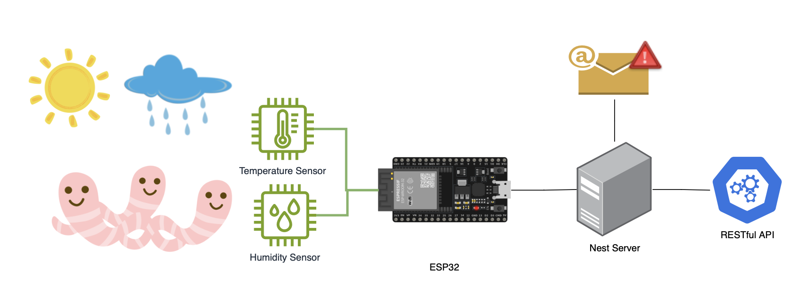

# Worms IoT

This is a solution created to monitor a farm of Californian worms which are sensitive to certain weather conditions such as humidity and temperature.

The project was achieved by using a ESP32 which was programmed in C to interpret the information coming from the sensors and deliver this information to a NestJS server which is in charge of alerting users in case of unhealthy conditions. NestJS server also offers a RestFul application to query farm metrics over long periods. 

## Components

- ESP32: micro-controller in charge of interpreting and delivering sensor info
- Nest server: server in charge of:
  - Storing info coming from ESP32 and alerting users
  - Offering API to consult the historical behavior of (temperature and humidity) metrics

